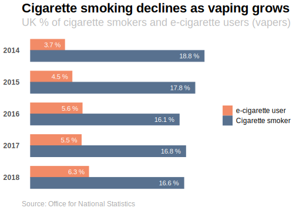
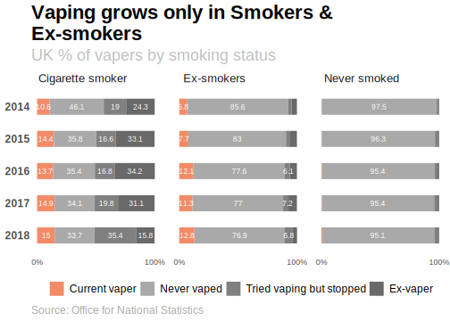

Improving a newspaper data vis story
================

[“Vaping lung illnesses spread as hundreds more affected in
US”](https://www.thetimes.co.uk/article/vaping-lung-illnesses-spread-as-hundreds-more-affected-in-us-5jdxkrqk6?shareToken=dfeabd933f4edbb5aa4c2472f99e9201)
was a Times newspaper story from September 2019. While the article
described vaping in America it included a chart of UK growth in
e-cigarette use. The chart contained figures from the ONS [“E-cigartte
use in Great
Britain”](https://www.ons.gov.uk/peoplepopulationandcommunity/healthandsocialcare/drugusealcoholandsmoking/datasets/ecigaretteuseingreatbritain)
data set.

As the chart can only be viewed by Times subscribers it has been
re-created below using the same ONS figures with a very similar layout
and style.

The title tells us the chart is about the growth of vaping in the UK.
However, it’s not clear what the percentages represent. What are they
percentages of? None of the figures add up to 100% either horizontally
across each row or vertically down each column. There must be additional
percentages not shown. Using the original data let’s see if we can
present a clearer and more engaging data story.


<details>

<summary>Show code</summary>

<p>

``` r
library(tidyverse)
library(readxl)

# http://www.cookbook-r.com/Graphs/

smoking_perc <- 
  readxl::read_excel("cleaned_smoking.xlsx", 
             sheet = "Table 1") 

smoking_perc_by_e_cig <- 
  readxl::read_excel("cleaned_smoking.xlsx", 
             sheet = "Table 2") %>% 
  tidyr::pivot_longer(cols = 3:5,
                      names_to = "cigarette_status",
                      values_to = "perc")

smoking_perc_reduced <- 
  smoking_perc %>% 
  dplyr::filter(e_cig_status == "Current e-cigarette user (vaper)") %>% 
  dplyr::mutate(cigarette_status = "Total") %>% 
  dplyr::select(Year, cigarette_status, perc) 

p <- smoking_perc_by_e_cig %>% 
  dplyr::filter(e_cig_status == "Current e-cigarette user (vaper)") %>%
  dplyr::bind_rows(smoking_perc_reduced) %>% 
  ggplot2::ggplot() +
  ggplot2::aes(x = reorder(Year, desc(Year)),
               y = perc,
               #colour = cigarette_status,
               fill = cigarette_status) +
  ggplot2::geom_bar(stat = "identity",
                    width=0.5, 
                    position = position_dodge2(width=0)) +
  ggplot2::facet_grid(facets = ~cigarette_status,
                      rows = 1) +
  ggplot2::coord_flip() +
  ggplot2::theme_minimal() +
  ggrepel::geom_text_repel(aes(label = paste(perc,"%")), 
                     nudge_y = -0.5,
                     colour = "black") +
  theme(axis.title.x = element_blank(),
        axis.text.x = element_blank(),
        axis.ticks.x = element_blank(),
        axis.title.y = element_blank(),
        axis.text.y = element_text(face="bold", 
                           size=12),
        strip.text.x = element_text(size = 12,
                                    hjust = 0.1),
        panel.grid.major = element_blank(),
        panel.grid.minor = element_blank(),
        panel.border = element_blank(),
        panel.background = element_blank(),
        legend.position = "none",
        plot.title = element_text(size = 22, 
                                  face = "bold"),
        plot.subtitle = element_text(color = "grey",
                                     size = 18),
        plot.caption = element_text(hjust = 0,
                                    size = 12,
                                    color = "darkgrey"),
    #    plot.background = element_rect(fill = "white"),
        panel.spacing = unit(1, "cm")
        ) +
  ggplot2::labs(title = "The growth of vaping in the UK",
                subtitle = "Proportion of people who smoke e-cigarettes by smoking status",
                caption = "Table: The Times  Source: Office for National Statistics") +
  ggplot2::scale_fill_manual(values = c("#58718F",
                                        "#E29153",
                                        "#4BB9C9",
                                        "#F28B67"))

ggplot2::ggsave(file="TheTimes.svg",
                plot = last_plot(),
                device = "svg",
                width=10, 
                height=6)
```

</p>

</details>

<br/>

First, we need to understand the original data better. What do the
percentages actually represent? By inspecting the original ONS data we
can see that the “Total” column in the Times chart is the percentage of
the entire UK population using e-cigarettes according to the ONS survey.

One improvement option is to chart only the percentage of UK vapers in
the UK. And to contrast that against the percentage of cigarette smoking
to see if it also changing each year. The chart below shows this
comparison using data from the [Adult smoking habits in the
UK: 2018](https://www.ons.gov.uk/peoplepopulationandcommunity/healthandsocialcare/healthandlifeexpectancies/bulletins/adultsmokinghabitsingreatbritain/2018)
ONS report. We can see a gradual drop in smoking each year as well as a
gradual rise in vaping.

Can we conclude from this chart that smokers quitting are taking up
vaping? Perhaps. But not if new e-cigarette users have continued smoking
or if new vapers have never smoked. We can test our theories with the
next new chart.

<!-- -->

<details>

<summary>Show code</summary>

<p>

``` r
smoke_vape <- data.frame(
        Year = c(2014, 2015, 2016, 2017, 2018),
      e_cigarettes = c(3.7, 4.5, 5.6, 5.5, 6.3),
     cigarettes = c(18.8, 17.8, 16.1, 16.8, 16.6)
) %>% 
  tidyr::pivot_longer(cols = 2:3,
                      names_to = "category",
                      values_to = "perc") %>% 
  dplyr::mutate(category = case_when(category == "cigarettes" ~ "Cigarette smoker",
                                     category == "e_cigarettes" ~ "e-cigarette user"))

p <- smoke_vape %>% 
  ggplot2::ggplot() +
  ggplot2::aes(x = reorder(Year, desc(Year)),
               y = perc,
              colour = category,
               fill = category) + 
  ggplot2::geom_bar(stat = "identity",
                    position = "dodge",
                    width = 0.7) +
  ggplot2::geom_text(aes(label = paste(perc,"%")),
            size = 5, 
            position = position_dodge(width = 0.7),
                                       hjust= 1.2,
            colour = "white")  +
  ggplot2::coord_flip() +
  ggplot2::theme_minimal() +
      theme(
        axis.title.y = element_blank(),
        axis.title.x = element_blank(),
        axis.ticks.x = element_blank(),
        axis.text.x = element_blank(),
        axis.text.y = element_text(face="bold", 
                           size=12),
        strip.text.x = element_text(size = 10),
        legend.text=element_text(size=12),
        panel.grid.major = element_blank(),
        panel.grid.minor = element_blank(),
        panel.border = element_blank(),
        panel.background = element_blank(),
        legend.position= "right",
        #legend.justification=c(0,0), 
        #legend.position=c(0.27,-0.01),
        legend.direction = "vertical",
        plot.title = element_text(size = 22, 
                                  face = "bold"),
        plot.subtitle = element_text(color = "grey",
                                     size = 18),
        plot.caption = element_text(hjust = 0,
                                    size = 12,
                                    color = "darkgrey"),
        legend.title = element_blank(),
#        plot.background = element_rect(fill = "white")
        ) +
  ggplot2::labs(title = "Cigarette smoking declines while vaping grows in the UK",
                subtitle = "Proportion of cigarette smokers and e-cigarette users (vapers)",
                caption = "Source: Office for National Statistics") +
  ggplot2::scale_fill_manual(breaks=c("e-cigarette user","Cigarette smoker"),
                             values = c("#58718F",
                                        "#F28B67")) +
    ggplot2::scale_colour_manual(breaks=c("e-cigarette user","Cigarette smoker"),
                                 values = c("#58718F",
                                        "#F28B67")) 

ggplot2::ggsave(file="WholePop.svg",
                plot = last_plot(),
                device = "svg",
                width=10, 
                height=6)
```

</p>

</details>

<br/>

This chart includes more of the ONS data than was shown in the original
Times chart. The percentages in orange are the same percentages of
vapers found in the first three columns of the original. But in
addition, this chart includes all categories of vaping behaviour so that
the percentages in each bar add up to 100% (i.e. also including “Never
vaped”, “Tried vaping but didn’t continue to vape” and “Ex-vaper”
percentages).

Does the greater detail make this chart easier to understand than the
original? Possibly. To reduce the cognitive burden for readers the the
main category of interest (the percentage of vapers) is picked out with
a strong orange colour, while the three other non-vaping categories are
shaded in grey tones. The aim is to draw our attention to the main story
in orange which is that **vaping is growing each year almost entirely
among current and ex-smokers, not among those who have never smoked.**
Perhaps a worrying trend for tobacco companies if market growth is only
among current or former smokers?

<!-- -->

<details>

<summary>Show code</summary>

<p>

``` r
#RColorBrewer::display.brewer.all()
my_pallete <- c("#696969","#808080","#A9A9A9","#F28B67")

smoking_perc_by_e_cig$e_cig_status <- 
  factor(smoking_perc_by_e_cig$e_cig_status, 
         levels = c(
                    
                    "Ex-vaper", 
                    "Tried vaping, but didn't continue to vape",
                    "Never vaped",
                    "Current e-cigarette user (vaper)" ))

p <- smoking_perc_by_e_cig %>% 
  ggplot2::ggplot() +
  ggplot2::aes(x = reorder(Year, desc(Year)),
                y = perc,
               # colour = e_cig_status,
               fill = e_cig_status
                          ) +
  ggplot2::geom_bar(stat = "identity",
                    width=0.5 
                    ) +
  ggplot2::facet_grid(facets = ~cigarette_status) +
  geom_text(aes(label = perc),
            data = smoking_perc_by_e_cig %>% filter(perc>6),
            size = 4, 
            position = position_stack(vjust = 0.5),
            colour = "white") +
  ggplot2::theme_minimal() +
  ggplot2::coord_flip() +
    theme(
        axis.title.y = element_blank(),
        axis.title.x = element_blank(),
        axis.ticks.x = element_blank(),
        axis.text.y = element_text(face="bold", 
                           size=12,
                           margin = margin(r = 0)),
        strip.text.x = element_text(size = 13,
                                    hjust = 0.1),
        legend.text=element_text(size=12),
        panel.grid.major = element_blank(),
        panel.grid.minor = element_blank(),
        panel.border = element_blank(),
        panel.background = element_blank(),
                plot.title = element_text(size = 22, 
                                  face = "bold"),
        plot.subtitle = element_text(color = "grey",
                                     size = 18),
        plot.caption = element_text(hjust = 0,
                                    size = 12,
                                    color = "darkgrey"),
        legend.position="bottom",
        legend.title = element_blank(),
  #      plot.background = element_rect(fill = "white"),
        panel.spacing = unit(1, "cm"),
        ) +
  ggplot2::scale_fill_manual(values = my_pallete) +
  ggplot2::scale_color_manual(values = my_pallete) +
  ggplot2::labs(title = "Vaping growing only among smokers and ex-smokers in the UK",
                subtitle = "e-cigarette user percentages in orange shown by smoking status",
                caption = "Source: Office for National Statistics") +
  ggplot2::guides(color = guide_legend(reverse = TRUE),
                  fill = guide_legend(reverse = TRUE)) +
  ggplot2::scale_y_continuous(breaks=c(0,100),
                              labels = function(x) paste0(x, "%"))

ggplot2::ggsave(file="Stacked.svg",
                plot = last_plot(),
                device = "svg",
                width=10, 
                height=6)
```

</p>

</details>

To further reduce the cognigive burden the non-vaping categories in grey
could be lumped into one category….
